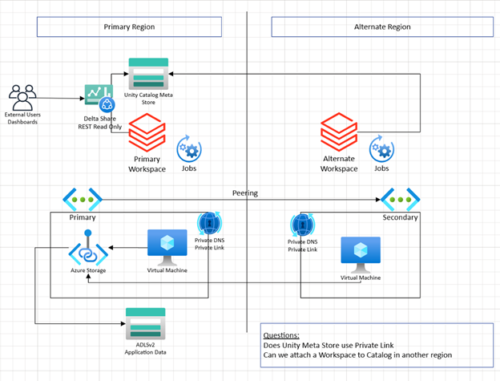
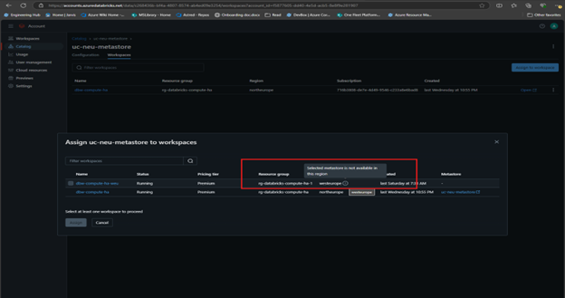
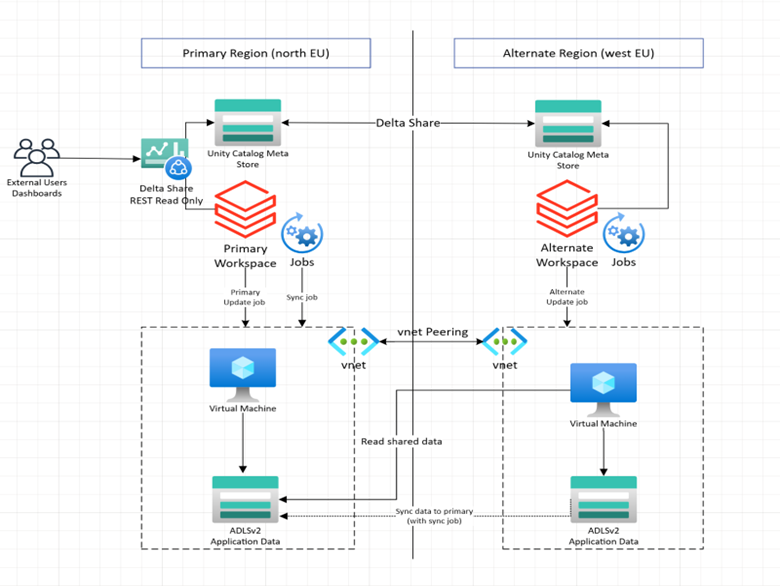

Azure Data Bricks Experiment Summary

# Azure Data Bricks and Unity Catalog

The primary objective of this experiment is to validate and demonstrate
the ability of Azure Databricks to perform a regional failover for
compute operations (VM creation and deletion) when an availability zone
experiences downtime or lack of compute capacity. Specifically, our goal
is to ensure that customers can create and manage Databricks clusters in
an alternate region while still utilizing storage and accessing the data
from the original region experiencing the outage.

Databricks workspaces now come with Unity Catalog (enabled by default)
which provides features such as enhanced data governance and
collaboration by providing a centralized data catalog and management
layer across all Databricks workspaces. Unity Catalog enables
fine-grained access control, metadata management and data lineage
tracking.

We assume that most Databricks customers will be using Unity Catalog, so
it’s included in our scenarios, even though it constrains our options
for using alternate compute locations.

# Objectives

- Validate the feasibility of creating and deleting VMs and Azure
  Databricks Clusters in an alternate region during an availability zone
  outage or during the capacity crunch.

- Ensure seamless access to storage and the data from the original
  region where the availability zone is down.

- Run the jobs and workloads in the alternate region:

  - without changing or updating the workloads.

  - without having to replicate the data to alternate region’s storage
    account.

- Document the procedures and best practices for configuring and
  managing regional failover for Azure Databricks when there is capacity
  crunch or availability zone outage.

# Background

Azure Data Bricks currently has a documented process on how to perform
regional disaster recovery (DR) for Databrick clusters. The article
describes a disaster recovery architecture useful for Azure data bricks
clusters and the steps to accomplish that design. Please see link on
[Regional disaster recovery for Azure Databricks \| Microsoft
Learn](https://learn.microsoft.com/en-us/azure/databricks/scenarios/howto-regional-disaster-recovery)

Azure Databricks has robust disaster recovery (DR) practices, but there
are some shortcomings to be aware of:

- **Data Corruption:** If data gets corrupted in the primary region, it
  will also be corrupted in the secondary region since the data is
  replicated. This means that disaster recovery solutions do not
  mitigate data corruption issues.

- **Complexity in Automation**: Implementing disaster recovery involves
  complex automation processes. Ensuring idempotent operations, managing
  infrastructure state, and minimizing configuration drift are critical
  and challenging tasks.

- **Latency Issues**: The compute (Azure Databricks) and storage sources
  must be in the same region to avoid high latency. This can limit
  flexibility in disaster recovery planning.

- **Recovery Time**: While Azure Databricks provides high availability
  within a single region, cross-regional disaster recovery can take
  time. The control plane functionality should be restored within
  approximately 15 minutes after an availability zone recovers, but this
  can vary.

- **<u>Cost:</u>** Maintaining multiple Azure Databricks workspaces in
  different regions can be costly. This includes the cost of
  geo-redundant storage and additional compute resources.

Also, zone outage or capacity issue does not qualify as the DR scenario.
Hence, the above DR solution may not be the right solution for customers
when trying to continue to use their workspaces during a temporary
capacity issue in Azure.

# Hypothesis

Given the background context, the following hypothesis was proposed:

- In case of zone outages or capacity crunch, only compute resources can
  be provisioned in alternate regions to support business continuity.

- Data from the original storage account need not be replicated to
  alternate region.

- Is it possible to connect to the primary workspace’s metastore or is
  only metadata required to execute queries and run the workloads in
  alternate region need to be replicated in alternate region’s
  metastore.

# Assumptions

- Enterprise customers leverage Unity Catalog for their metastore in
  their Azure Databricks workspace deployments.

# Result Summary

- Even though Unity Catalog is rich with data management and governance
  features, there some architectural limitations:

  - Unity Catalog metastore is region specific with a region having (by
    default) only 1 metastore.

  - Cross region metastore assignment for workspaces is not supported.
    i.e. you can’t create a workspace in an alternate region and
    reference the existing Unity Catalog in the original region.

- The above architectural limitations can be overcome with Delta Sharing
  feature. Delta sharing is read only where only metadata is replicated.
  Data in Azure Storage account is not replicated.

- To address the compute capacity issue in primary region, the proposed
  solution is to leverage Unity Catalog with Delta sharing and some
  workarounds.

  - Primary data is delta shared with alternate region where compute
    capacity is provisioned.

  - Jobs need to be parameterized to support execution in other region.

  - The alternate region needs its own metastore and Unity Catalog.

  - Additional jobs/workloads need to be implemented in primary region
    to sync the data back from alternate region (shared via Delta
    sharing).

# Next Steps

Based on the results and learnings from the experiments (detailed in
below sections), here are some of the next steps:

- Having conversations with Databricks team w.r.t some of the current
  technical limitations:

  - Understanding why multiple workspaces across regions cannot share
    the same Unity Catalog metastore in a particular (the primary)
    region. Is there a way to relax this restriction?

  - They (Databricks) are working on auto replication between Unity
    Catalogs for their broader DR solution (a solution that includes
    data replication). The question is whether they could extend the
    Catalog replication to alternate regions for use without data
    replication.

- Develop a sample blueprint (e.g.: scripts and terraform modules) of
  the proposed approach which can be used by CSA team to do some POCs
  for the customers. We’re modeling this example after the approach
  selected by customer.

# Experiments

The following experiments were performed to validate the hypothesis:

## \[Experiment \#1\] Single Shared Unity Catalog between Primary and Alternate DB Workspace

### Environment Setup

The following resources are created in the primary region. For this
experiment, the primary region is North Europe.

1.  Create a virtual network with public and private subnet.

2.  Create ADLS Gen 2 account with hierarchical namespace in the same
    VNET to store the metadata (in Unity Catalog) and data.

3.  Create Azure Databricks workspace in the same VNET.  
    **Note:** Post November 2023, Unity catalog is installed and enabled
    by default when the Databricks workspace is setup. But we need to
    setup the metastore manually as customers might have multiple
    workspaces assigned to the same metastore.

    1.  Create Azure Databricks Access Connector in Azure portal. Grant
        connector identity with ‘Storage Blob Data Contributor’ perms on
        the storage account and its container.

    2.  Make sure the user has Global Admin privileges so that user can
        access <https://accounts.azuredatabricks.net/> to create new
        metastore.

    3.  Create Unity Catalog metastore. Assign the workspace to the
        newly created metastore. (Note: We’ll need to delete the default
        Unity Catalog metastore created when workspace is created as
        there cannot be multiple metastores in the same region).

    4.  Grant the appropriate permissions to create/view catalog, schema
        and table.

4.  After assigning the workspace, create schema and table and insert
    some dummy data into the table. Run the queries, against the table.

Once the primary region is setup and queries are run successfully, set
up the Databricks workspace in the alternate region. The alternate
region is West Europe. The same steps which are highlighted above are
followed to attach the existing metastore from North Europe.

### Observations and Learnings

- Unity Catalog metastore is region specific. There can be only one
  metastore in a particular region. Multiple workspaces in the same
  region can be assigned to the same metastore.

- Workspace from West Europe cannot be assigned to Unity Catalog
  metastore in the North Europe region. Cross region
  metastore assignment is not supported by Databricks.

## \[Experiment \#2\] Separate Unity Catalogs with Delta Sharing within Primary and Alternate Regions’ DB workspace

### Environment Setup

This experiment setup is an extension of the above experiment. The
following modifications are done to the existing setup:

1.  Create and setup vnet peering between the vnets of the primary and
    alternate regions so that they are accessible.

    - Add vnet of alternate region in the allowlist of the primary
      region and vice versa as well.

2.  Once the vnet peering is done, we need to setup the delta sharing
    between primary and alternate regions. (For more details, please see
    reference \#1)

    - The data provider in the primary region creates data recipient.
      This is done by adding the unique identifier provided the Unity
      Catalog metastore of the alternate region. A recipient is an
      object in the Unity Catalog metastore which represents the user, a
      group who can access the data shared by the data provider.

    - Create a data share in the provider’s Unity Catalog metastore. The
      share can be catalog, schema, table or views.

    - Once the share and recipients are created, the provider grants the
      recipients with relevant permissions to access the shared data.

3.  The share is now available in the alternate region’s Databricks
    workspace. The user creates a catalog in the alternate region using
    the share so that they can access the data via CLI, SQL or
    notebooks.

4.  The shared data (catalog/schema/tables) is read-only. Hence, we need
    to create a ‘temp’ table in the alternate region. The schema of the
    table is the same as that of the primary.

5.  Create a job in the alternate region which does the following:

    - \[Optional\] Reads the data from the primary shared table and
      alternate ‘temp’ table if needed.

    - Performs the updates and writes the data back to the ‘temp’ table
      in the alternate region.

6.  The ‘temp’ table in the alternate region is delta shared back to the
    primary region (using the same steps mentioned in step \# 2-3).

7.  Once the capacity in the primary region is available, the sync job
    in the primary region can read the newer data from the shared ‘temp’
    table and sync it back to the primary table using customer’s
    app/scenario specific logic.

### Observations and Learnings

Here are some of the key observations and learnings we noticed as part
of this experiment (with delta sharing feature):

- Unity Catalog’s limitation of cross region metastore assignment can be
  overcome by leveraging delta sharing feature.

- Additional compute capacity in the alternate region can be used, thus
  leading to business continuity.

- Actual data in the ADLS V2 is not replicated from the primary region.
  The alternate region queries the data from the primary region’s
  storage account.

- Only the metadata required for queries to run is replicated with the
  alternate region (as part of Delta sharing). Example: Partitions,
  schema and structural metadata. Fine grained metadata such as column
  and table properties, tags are not replicated.

Along with the highs, there are some challenges observed (along with
ones captured earlier in this document):

- Since the job/workload in alternate region is querying the data
  present in the primary ADLS v2 storage account, we need to allowlist
  the alternate region to access the storage account.

- Complex setup is required with Delta Sharing enabled Unity Catalog in
  primary-alternate regions with vnet peering.

- Changes in the job parameters are required when running the job in
  alternate region so that the output is written to the local (‘temp’)
  table in the alternate region.

- Due to the read-only limitation of Delta share, additional complexity
  is added as we need to sync the data from the alternate region back in
  the primary region’s table.

# Learnings

Based on the 2 experiments performed, here are some of the key lessons
learnt:

- There are some architectural limitations in Databricks platform:

  - Unity Catalog metastore is region specific and a region having (by
    default) only 1 metastore.

  - Cross region metastore assignment for different Azure Databricks
    workspaces is not supported.

- Data shared via Delta Sharing in Unity Catalog is read-only. Hence,
  workarounds and complex setup (temp table and delta sharing and sync
  back to primary) are required to overcome the compute capacity issues.

# References

- [Regional disaster recovery for Azure Databricks \| Microsoft
  Learn](https://learn.microsoft.com/en-us/azure/databricks/scenarios/howto-regional-disaster-recovery?wt.mc_id=knwlserapi_inproduct_azportal#how-to-create-a-regional-disaster-recovery-topology)

- [Disaster recovery - Azure Databricks \| Microsoft
  Learn](https://learn.microsoft.com/en-us/azure/databricks/admin/disaster-recovery?wt.mc_id=knwlserapi_inproduct_azportal#step-2-choose-a-process-that-meets-your-business-needs)

- <https://docs.databricks.com/en/delta-sharing/share-data-databricks.html>
